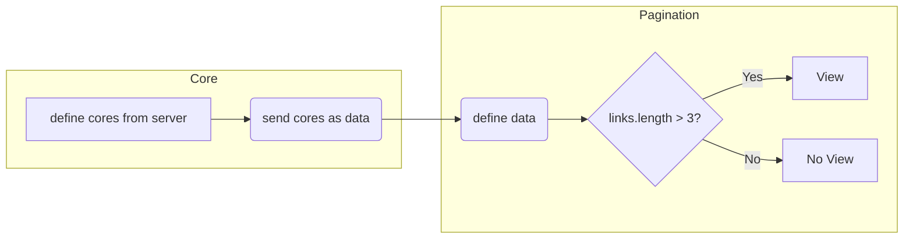

# Flowchart

<br/>

<!--MERMAID {width:100}-->

<!--MCONTENT {content: "flowchart LR<br/>\nB\\-\\-\\>C<br/>\nsubgraph Core<br/>\nA\\[define cores from server\\] \\-\\-\\>B(send cores as data)<br/>\nend<br/>\nsubgraph Pagination<br/>\nC(define data) \\-\\-\\>D{links.length > 3?}<br/>\nD\\-\\-\\>|Yes| E\\[View\\]<br/>\nD\\-\\-\\>|No| F\\[No View\\]<br/>\nend<br/>"} --->

<br/>

<br/>

# Core Component

<br/>

Define cores from server
<!-- NOTE-swimm-snippet: the lines below link your snippet to Swimm -->
### 📄 resources/js/Pages/Core.vue
```vue
7      const props = defineProps({
8          cores:{
9              type: Object,
10             default: () => ({}),
11         },
```

<br/>

Send cores as data
<!-- NOTE-swimm-snippet: the lines below link your snippet to Swimm -->
### 📄 resources/js/Pages/Core.vue
```vue
86             <Pagination :data="props.cores" />
```

<br/>

Import the component
<!-- NOTE-swimm-snippet: the lines below link your snippet to Swimm -->
### 📄 resources/js/Pages/Core.vue
```vue
3      import Pagination from '@/Components/Pagination.vue'
```

<br/>

# Pagination Component

<br/>

Define data
<!-- NOTE-swimm-snippet: the lines below link your snippet to Swimm -->
### 📄 resources/js/Components/Pagination.vue
```vue
4      defineProps({
5          data: {
6              type: Object,
7              default: () => ({}),
8          },
9      });
```

<br/>

Line 14<br/>
Check **data links length** property. If more than 3, execute

Line 16-21<br/>
Iterate three properties, **Active**, **url** and **label** properties. **link** and **k** are local variables inside for loop.<br/>
**link** is object inside collection. **k** is key
<!-- NOTE-swimm-snippet: the lines below link your snippet to Swimm -->
### 📄 resources/js/Components/Pagination.vue
```vue
14         <div v-if="data.links.length > 3" class="flex justify-center mt-4 space-x-4">
15             <Link
16                 v-for="(link, k) in data.links"
17                 :key="k"
18                 class="px-4 py-3 text-sm leading-4 bg-white rounded hover:bg-white focus:text-indigo-500 hover:shadow"
19                 :class="{'bg-indigo-400 text-white': link.active}"
20                 :href="link.url"
21                 v-html="link.label"
22             />
23         </div>
```

<br/>

<br/>

<br/>

<br/>

<br/>

<br/>

<br/>

<br/>

This file was generated by Swimm. [Click here to view it in the app](/repos/Z2l0aHViJTNBJTNBaW1wcm9mZGJ2dWUlM0ElM0FtZGF6cmlu/docs/yap1q).
